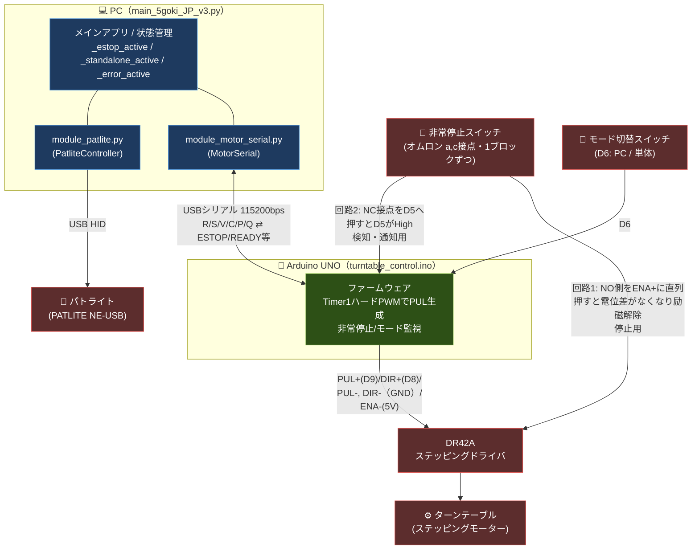
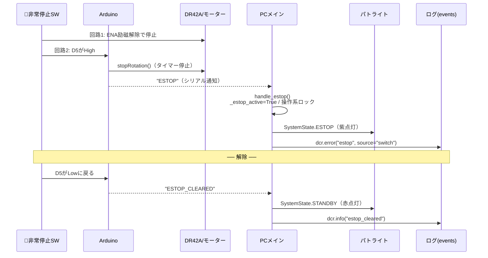
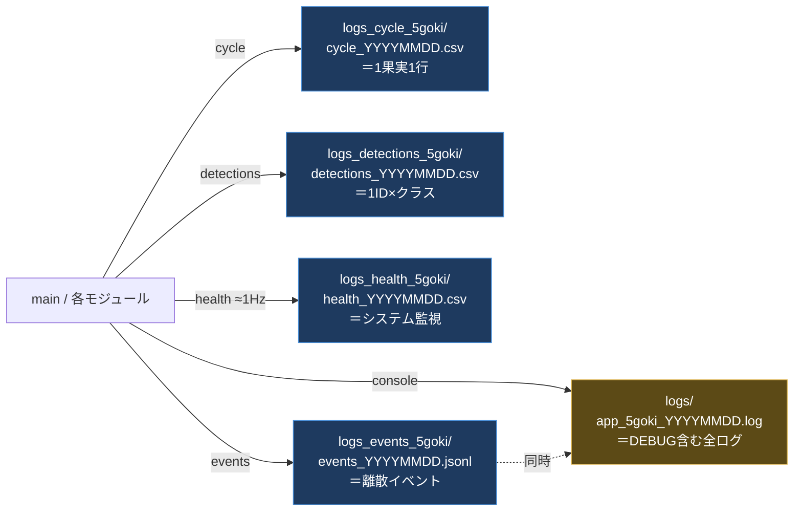

# DCRsystem — サクランボ自動選別システム（5号機 v3）

**画像中央の推論ゲートを通過する瞬間だけ推論する版（feature-about-center）**

YOLO（物体検出AI）と産業用カメラを組み合わせた、サクランボのリアルタイム欠陥検出・自動選別システム。
4台のBaslerカメラで果実を多角的に撮影し、AIの判定結果に基づいてリレーボードで選別アクチュエーターを制御する。
ターンテーブルの搬送は **Arduino UNO**（USBシリアル接続）が担当し、非常停止スイッチによる安全停止に対応する。

```
果実投入
   ↓
ターンテーブル搬送（Arduino UNO の Timer1 ハードウェアタイマーでステッピングモーター制御）
   ↓
4台のカメラで撮影（上・下・内・外）
   ↓
HSVフィルタ（存在検知）→ 推論ゲート通過中のみ YOLO 推論 → 4カメラの結果を統合して確定
   ↓
リレーボードで振り分け
 ├─ 健全果   → 運搬ライン（TRANSPORT）
 └─ それ以外 → 除去ライン（REMOVE）
```

---

## 目次

1. [ハードウェア構成](#ハードウェア構成)
2. [ファイル構成](#ファイル構成)
3. [検出・判定ロジック](#検出判定ロジック)
4. [ターンテーブル制御と非常停止（Arduino）](#ターンテーブル制御と非常停止arduino)
5. [システム状態とパトライト](#システム状態とパトライト)
6. [動作フロー](#動作フロー)
7. [ログ構成](#ログ構成)
8. [セットアップ](#セットアップ)
9. [搬送スピード設定](#搬送スピード設定)

---

## ハードウェア構成

| 機器 | モデル / 接続方法 | 用途 |
|-----|----------------|-----|
| 産業用カメラ × 4 | Basler daA1280-54uc-S（pypylon / USB3） | 果実の多角撮影（20 FPS、念のため1台あたり帯域100MB/sに制限） |
| パトライト | PATLITE NE-USB（HIDAPI / USB） | システム状態の表示 |
| リレーボード | RLY-P4/2/0B-UBT（Ydci.dll） | 振り分けエアータイミング制御 |
| 回転台制御 | Arduino UNO（USBシリアル / 115200bps） | ステッピングモーターのパルス生成・非常停止監視 |
| ステッピングドライバ | MiSUMi DR42A | Arduino のパルスでモーター駆動 |
| 非常停止スイッチ | オムロン製（a,c接点 × 1ブロック） | 安全停止（物理遮断＋PC通知の二重化） |
| PC（本アプリ） | Windows 11 + GPU推奨 | AI推論・GUI・制御統括 |

### カメラ配置

カメラ名とシリアル番号の対応は `module_cameras_5goki_v2.py` の `TARGET_SERIALS` で定義。
各カメラの設定は `cam_pfs/<カメラ名>_<シリアル>.pfs` を起動時に読み込む。

| カメラ名 | シリアル番号 | 役割 |
|---------|----------|-----|
| cam_top | 25453227 | 上面撮影 |
| cam_under | 25453229 | 下面撮影（表示遅延同期あり） |
| cam_inside | 25308967 | 内側撮影（表示遅延同期あり） |
| cam_outside | 25308968 | 外側撮影 |

> cam_under / cam_inside は検知位置までの搬送時間ぶん表示を遅らせる。
> 遅延秒数は `json/delay_config.json`（`standalone/delay_calibration.py` で調整）から読み込み、無ければ既定値（約2.0秒）で動作する。

### 物理・通信の接続図



---

## ファイル構成

```
（プロジェクトルート）
│
├─ main_5goki_JP_v3.py          ★メインアプリ（GUI・全デバイス統括・状態管理）
│
├─ ◆ デバイス制御モジュール
│   ├─ module_motor_serial.py     Arduino と USB シリアル通信（ターンテーブル回転）
│   ├─ module_patlite.py          パトライト制御（HID/USB・システム状態表示）
│   ├─ module_relay.py            リレーボード制御（Ydci.dll・健全果/被害果の振り分け）
│   ├─ module_cameras_5goki_v2.py Basler カメラ4台制御（pypylon）
│   └─ module_gui_JP_v3.py        GUI ウィジェット定義（PySide6）・クラス表示定義 CLASS_DISPLAY
│
├─ ◆ AI 推論
│   ├─ module_yolo_csv4_v3.py     YOLO 推論・ByteTrack 追跡・個体確定ロジック・検出ログ出力
│   └─ Trained_Models/            学習済みモデル（Git管理外。MODEL_PATH が参照）
│
├─ ◆ ロギング基盤
│   ├─ dcr_logger.py              構造化データログ（cycle/health/events/detections）
│   ├─ log_config.py              コンソール logging 統一設定（色付き・ファイル出力）
│   └─ telemetry_sources.py       CPU/GPU/メモリ等のテレメトリ取得（psutil/nvml/LHM）
│
├─ ◆ Arduino（PC外・マイコン側）
│   └─ Arduino/turntable_control.ino   ステッピングモーター制御 + 非常停止・モード監視
│
├─ ◆ 設定ファイル
│   ├─ cam_pfs/                   Baslerカメラ設定（.pfs × 4台分）
│   ├─ json/                      HSVフィルタ（カメラ別）/ リレー角度補正 / カメラ表示遅延
│   └─ Icon/                      GUIアイコン画像
│
├─ ◆ 出力（実行時に自動生成）
│   ├─ logs/                      コンソールのフルログ（app_5goki_YYYYMMDD.log）
│   ├─ logs_cycle_5goki/          サイクルログ CSV（1果実=1行）
│   ├─ logs_health_5goki/         ヘルスログ CSV（≈1Hz システム監視）
│   ├─ logs_detections_5goki/     検出ログ CSV（1ID×クラス）
│   └─ logs_events_5goki/         イベントログ JSONL（離散イベント・エラー）
│
├─ ◆ 補助スクリプト
│   ├─ standalone/                キャリブレーションツール群
│   │     hsv_calibration.py        HSVフィルタ調整（カメラ別JSONを生成）
│   │     delay_calibration.py      カメラ表示遅延の調整
│   │     relay_calibration.py      リレー開弁角度の合わせ込み
│   │     hsv_filter_save.py
│   ├─ ripeness_classifier/       果実熟度分類器（モジュール分割済み。2バリアント）
│   │     common/                   バリアント共通ユーティリティ（画像入出力・HSVマスク処理）
│   │     base/                     本体（未熟/過熟マスク占有率の直接比較で判定）main.pyで起動
│   │     grayworld/                グレーワールド正規化版（カメラ色温度差を吸収、判定ロジックはbaseに追従）main.pyで起動
│   │     json/                     各バリアントのHSV閾値設定（hsv_ripeness_config*.json）
│   ├─ analysis/                  ログ解析（DuckDBクエリ集 queries.sql・プロット・レポート）
│   └─ gui_test/                  GUIプレビュー（preview_gui_live.py）
│
└─ README.md / pyproject.toml / requirements.txt
```

- 使用モデルは `module_yolo_csv4_v3.py` の `MODEL_PATH` で指定（現行 `Trained_Models/v4_11s.pt`）。
- 判定済みタイル画像（`evaluated_images/`）と学習用画像（`training_images/`）の保存機能はコード内にあるが、**現在はコメントアウトで一時停止中**。

---

## 検出・判定ロジック

`module_yolo_csv4_v3.py` に実装。

### 検出クラス（14クラス）

GUI表示・集計（`module_gui_JP_v3.CLASS_DISPLAY`）で定義されているクラス。
振り分けは「**healthy → TRANSPORT（運搬）、それ以外 → REMOVE（除去）**」の2系統のみ。

| No. | ラベル名 | 日本語名 | 振り分け先 |
|-----|---------|---------|----------|
| 1 | healthy | 健全果 | **TRANSPORT（運搬）** |
| 2 | birddamage | 鳥害 | REMOVE（除去） |
| 3 | blacktwin | 黒双子 | REMOVE（除去） |
| 4 | brownrot | 灰星病 | REMOVE（除去） |
| 5 | crack | 裂果 | REMOVE（除去） |
| 6 | insect | 虫害 | REMOVE（除去） |
| 7 | kasure | 擦れ果 | REMOVE（除去） |
| 8 | malformation | 奇形果 | REMOVE（除去） |
| 9 | mold | カビ | REMOVE（除去） |
| 10 | stemcrack | 果梗裂果 | REMOVE（除去） |
| 11 | suturecrack | 縫合線裂果 | REMOVE（除去） |
| 12 | twin | 双子果 | REMOVE（除去） |
| 13 | unripe | 未熟果 | REMOVE（除去） |
| 14 | wilt | 萎凋果 | REMOVE（除去） |

> モデルに新クラスが増えて `CLASS_DISPLAY` 未登録だった場合も、警告ログを残したうえで不良として除去する（無言の取りこぼし防止）。

### 推論ゲート（中心帯）— このブランチの特徴

各カメラのROI中央に左右2本の縦線（ゲート）を置き、**HSVマスクの最大ブロブが2本の線を両方跨いでいる間だけ** YOLO推論を実行する。

- 線の位置はROI中心からの絶対ピクセルでカメラ別に指定（`BAND_HALF_PX`）。GUIに縦線として表示される。
- 帯の外では推論せず、無駄なGPU負荷とフレーム遅延を抑える。

### 2段階の信頼度フィルタ

| 段階 | 閾値 | 役割 |
|-----|-----|-----|
| トラッカー前段 | `PREDICT_CONF = 0.1` | 低めにして ByteTrack に多くの情報を渡し追跡精度を上げる |
| ラベル採用 | `CONF_THRESHOLD = 0.5` | この値以上の検出だけを判定・表示に使う |

さらにクラス別の strict 閾値（`STRICT_THRESHOLDS`）を満たさない検出は判定に採用しない:

| クラス | strict 閾値 |
|-------|-----------|
| stemcrack / crack / birddamage | 0.8 |
| twin / blacktwin / malformation / unripe | 0.9 |
| 上記以外（mold, brownrot など） | 閾値なし（常に採用） |

### 個体の区切り（セグメンテーション）

- **出口**: 全カメラで `EMPTY_TIMEOUT_SEC = 0.5` 秒間サクランボが検出されなければ「1個通過し終わった」とみなし判定を確定する。
- **入口**: 可視時間が `MIN_VISIBLE_SEC = 0.12` 秒未満でYOLO検出も無い瞬間的なノイズは破棄し、幽霊IDを防ぐ（YOLO検出が1度でもあれば本物として扱う）。

### 最終判定（4カメラの結果統合）

`_resolve_best_result()` が全カメラの検出履歴から1クラスを確定する。

1. **複数カメラ一致による確定**（信頼度の大小によらず確定）
   - twin / malformation / blacktwin: **2台以上**の異なるカメラで検出 → 確定（`MULTI_CAM_MIN = 2`）
   - unripe: **3台以上**で検出 → 確定（`UNRIPE_MIN_CAMS = 3`）
2. **フォールバック**（上記が不成立のとき）
   - 未熟・健全以外の不良が1つでもあれば、その中の最高信頼度クラスを採用（**不良 ＞ 健全**）
   - 残りが unripe と healthy のみなら、**検出した異なるカメラ数の多い方**を採用。同数なら信頼度が高い方（同値は unripe 優先）

---

## ターンテーブル制御と非常停止（Arduino）

ターンテーブルは Arduino UNO の **Timer1 ハードウェアタイマー**（CTCモード、OC1A=D9）でパルスを生成する。
CPU負荷と無関係に正確な周波数を出し続けるため、ジッタが少なく異音が出にくい。

### 動作モード（D6 の物理スイッチで切替）

| モード | 動き | 非常停止時 |
|-------|-----|----------|
| **PCモード** | PCのGUIから USBシリアル経由でコマンド（回転/停止/速度）を受信して動作 | Arduinoが即停止＋PCへ `ESTOP` 通知。解除後もPCの再指令まで停止維持 |
| **単体モード** | PCなしで Arduino 単独で回転（操作は非常停止スイッチのみ） | 同上。ただし解除で自動再開 |

単体モード中、PC側はGUI全体をオーバーレイでロックし、パトライトを消灯する（Arduino単独運転を妨げない）。

### シリアルプロトコル（`module_motor_serial.py` ⇄ `turntable_control.ino`）

- **PC → Arduino**: `R`（回転）/ `S`（停止）/ `V<1-10>`（速度）/ `C`（停止・初期化）/ `P`（ping、`OK:PONG` が返る）/ `Q`（非常停止状態の問い合わせ）
- **Arduino → PC（非同期通知）**: `READY`（起動完了）/ `ESTOP`・`ESTOP_CLEARED`（非常停止 作動/解除）/ `STANDALONE`・`PC_MODE`（モード切替）
- 接続ポートは自動検出（Arduino/CH340/FTDI 等の識別子で探索）。失敗時は `main_5goki_JP_v3.py` の `SERIAL_PORT` に `"COM3"` 等を直接指定する。
- PC側は約30秒間隔で `P` を送りハートビート（応答遅延を `arduino_heartbeat` イベントに記録）。

### 非常停止スイッチ（2回路で二重化）

| 経路 | 配線 | 役割 | 信頼性 |
|-----|-----|-----|------|
| **回路1（回転停止）** | NO接点を DR42A の ENA+ に直列 | 押すとENAの電位差がなくなり励磁解除＝確実にモーター停止 | ハードのみ・フェイルセーフ |
| **回路2（通知・表示）** | NC接点を Arduino D5 へ（内部プルアップ） | 押すと接点が開いてD5がHigh → Arduinoが検知しPCへ `ESTOP` 通知・状態LED点滅 | ソフト経由 |

入力は20msのデバウンス付き。非常停止中は `R` コマンドを `ERR:ESTOP` で拒否する（ロックアウト）。

### 非常停止 → 各デバイスの連鎖（PCモード）



---

## システム状態とパトライト

`module_patlite.py` の `SystemState` がシステム状態とLED表示を対応づける（ブザーは全状態で無効）。

| 状態 | LED | タイミング |
|-----|-----|---------|
| INITIALIZING | 黄 点灯 | 起動・デバイス接続中 |
| STANDBY | 赤 点灯 | 待機中（停止状態） |
| RUNNING | 緑 点灯 | 正常運転中 |
| ESTOP | 紫 点灯 | 非常停止中（人が監視中のためブザー無し） |
| ERROR | 赤 点滅 | 想定外異常（カメラ切断等）。GUIのステータスバーも赤点滅で連動 |
| STANDALONE | 消灯 | Arduino単体モード中（PC管理外） |

PC側は `_estop_active` / `_standalone_active` / `_error_active` の3フラグで排他制御し、
解除・復帰時の表示の取りこぼしを防ぐ（優先度: カメラエラー ＞ 単体モード ＞ 非常停止 ＞ 通常）。

GUIのステータスバー（RUN / STOP / ESTOP / ERROR）もパトライトと同じ配色で現在状態を強調表示する。

---

## 動作フロー

1. **起動** → スタートアップウィンドウが表示される
2. **接続** → パトライト・リレーボード・Arduino・カメラを初期化（パトライトが黄点灯）
3. **状態同期** → Arduino に `Q` を送り、現在の非常停止／モード状態をPC側へ反映
4. **待機** → メインウィンドウ（フルスクリーン）に移行（パトライトが赤点灯）
5. **運転開始** → トグルスイッチONでモーター回転・推論開始（パトライトが緑点灯）
6. **推論** → 4カメラの映像を推論ゲート通過中のみYOLOで判定し、確定した結果をリレーへ送信。GUIには確定クラス＋他検出クラスの履歴（直近5件）とクラス別カウントを表示
7. **停止** → トグルスイッチOFFまたは電源ボタンで終了。非常停止スイッチでも即停止

---

## ログ構成

ログは **2系統** で設計されている。両者は **events** で接続され、エラー等の離散イベントはコンソール（System B の整形表示）と `events_*.jsonl`（System A の構造化記録）の**両方**へ同時に出る。

- **System A: 構造化データログ**（`dcr_logger.py`）… 機械可読。DuckDB で解析するための `cycle` / `health` / `events` / `detections` の4層。書き込みは専用スレッドでホットパスをブロックしない。標準ライブラリのみで動作。
- **System B: コンソール出力の統一**（`log_config.py`）… 散在していた `print` を Python の `logging` に集約し、書式・レベル・モジュール名・色を統一。DEBUG以上を `logs/app_5goki_YYYYMMDD.log` に全て残す。

### 出力ファイル一覧



| 出力先 | 形式 | 粒度 | 役割 |
|-------|-----|-----|-----|
| `logs_cycle_5goki/cycle_YYYYMMDD.csv` | CSV | 1果実=1行 | 撮影〜推論〜排出のタイミング/レイテンシと判定結果 |
| `logs_detections_5goki/detections_YYYYMMDD.csv` | CSV | 1ID×クラス | 各果実でどのクラスをどの信頼度で何個検出したか |
| `logs_health_5goki/health_YYYYMMDD.csv` | CSV | ≈1Hz | CPU/GPU/メモリ/VRAM等のシステム健全性監視 |
| `logs_events_5goki/events_YYYYMMDD.jsonl` | JSONL | 離散イベント | 起動/停止・非常停止・Arduino接続・カメラエラー等 |
| `logs/app_5goki_YYYYMMDD.log` | テキスト | 全ログ | コンソールと同じ内容＋DEBUG |

### 各ログの主な列と用途

**① cycle（1果実ごと）— ボトルネック・遅延の分析**
- `capture_latency[ms]` / `infer_latency[ms]` / `preproc[ms]` / `postproc[ms]` … 各工程の所要時間
- `frame_dropped[n]` … フレーム取りこぼし / `hsv_flag` / `hsv_mask_ratio` … HSVフィルタの通過状況
- `eject_flag` / `planned_eject_ts` / `eject_delay[ms]` / `outcome_flag` … 排出の予定vs実績・成否
- `yolo_no_det_flag` … HSVは通過したがYOLO未検出だったケース
- HW負荷も併記（`gpu_temp` / `gpu_util[%]` / `gpu_clock[mhz]` / `gpu_mem_used[mb]` / `gpu_power[w]` / `cpu_temp` / `cpu_util[%]`）→ **果実が来た瞬間の負荷**を相関分析できる

**② detections（多ラベル）— AI判定の中身**
- `class` / `conf_min` / `conf_max` / `conf_ave` / `num_detections` / `final_flag`
- →「健全と確定したが裏に低信頼の不良検出があった」等、**判定の根拠**を後追いできる

**③ health（≈1Hz）— 連続的なシステム健全性・障害予兆**
- `cpu_temp` / `gpu_temp` / `gpu_util[%]` / `gpu_clock[mhz]` / `gpu_power[w]` → サーマルスロットリング・HWダウングレード判断
- `proc_rss[mb]` / `torch_vram_alloc[mb]` / `torch_vram_reserved[mb]` / `cycles_total[n]` → メモリ/VRAMリーク検出（MB/サイクル算出）
- `ram_used[mb]` / `disk_free[gb]` / `queue_depth[n]`（フレームキューの詰まり）
- `dropped_logs[n]` … ロガー自身が捨てたログ数（自己監視）

**④ events（JSONL）— 出来事の時系列**
- `startup`（model / imgsz / precision / batch / gpu_name / gpu_mem_total_mb）/ `shutdown`（uptime_s）
- `gui_state`（run/stop）、`estop` / `estop_cleared`
- `arduino_connect` / `arduino_disconnect` / `arduino_heartbeat` / `arduino_params`
- `camera_error`、`mem_snapshot`（tracemalloc、約60秒ごと）など

### 設計上の約束

| 約束 | 内容 |
|---|---|
| ホットパス非ブロッキング | `dcr.cycle()` 等は `queue.put_nowait` のみ。書込み・fsyncは専用スレッド。満杯時はドロップして `dropped_logs[n]` に加算（ループは止めない） |
| 単位は列名に埋める | `[ms]` `[%]` `[mhz]` `[mb]` `[gb]` `[w]` `[n]` の角括弧表記。欠損は空文字 |
| 時間軸の二重化 | 同じHW指標を **cycle（果実が来た瞬間・不等間隔）** と **health（1Hz・アイドル含む）** の両方に記録し、負荷時とアイドル時を比較可能に |
| テレメトリはキャッシュ | GPU等の値は health スレッドが ≈1Hz で `Telemetry` に格納し、cycle は最新値を読むだけ（ホットパスで nvml を叩かない。最大約1秒前の値） |
| 結合アンカー | `timestamp`（ms精度のローカル時刻）と `cycle_id` で4ファイルを DuckDB で突き合わせ |
| クラッシュ耐性 | CSV追記＋`flush_interval_s`（既定1秒）ごとに flush+fsync。日付でローテーションし、同日の再起動は `# === SESSION START/END ===` コメント行で区切る |
| 標準ライブラリのみ | コア `dcr_logger.py` は外部依存なし。psutil / nvidia-ml-py / torch が無くても該当列が空になるだけで落ちない |
| schema_version | 全CSV行・eventsに自動付与（現行 `1.0.0`）。フォーマット変更後もファイル単位で判別可能 |

> CPU温度は LibreHardwareMonitor の Web Server（`localhost:8085`）経由で取得する。LHM を管理者権限で起動し Remote Web Server を有効にしておく（無ければ列が空になるだけ）。

### 公開 API（実際の呼び出し例）

```python
from dcr_logger import DCRLogger, Telemetry
import log_config

# --- 起動時（main の最初）---
log_config.setup_logging(line="5goki")            # コンソール整形（System B）を先に
dcr = DCRLogger(base_dir="logs", line="5goki")    # データログ（System A）
dcr.start(log_startup=False)                      # 書き込みスレッドだけ先に起動
# … モデルロード後、構成が揃ってから startup を記録（precision 等を載せるため）
dcr.log_startup(model="v4_11s.pt", imgsz=640, precision="fp32", batch=1)
dcr.start_mem_snapshot(60.0)                      # tracemalloc 定期スナップショット（任意）

# --- コンソール出力（各モジュール）---
mlog = log_config.get_logger("motor")
mlog.info("接続しました (COM3)")      # INFO: コンソール + ファイル
mlog.warning("READY応答がありません") # WARN: 黄
mlog.error("接続エラー: ...")         # ERROR: 赤
mlog.debug("[Serial Send] R")         # DEBUG: ファイルのみ

# --- 構造化イベント（コンソール + JSONL 両方）---
dcr.info("gui_state", state="run", speed=6, msg="トグルスイッチ ON")
dcr.error("estop", source="switch", trigger="NC_open")

# --- サイクル（1果実ごと・非ブロッキング。分かる値だけ渡せばよい）---
dcr.cycle(cycle_id=cid, hsv_mask_ratio=0.62,
          **{"infer_latency[ms]": 12.3, "eject_flag": 1, "outcome_flag": 1})

# --- ヘルス（≈1Hz）---
dcr.health(**{"cpu_temp": 55.0, "gpu_temp": 70.0, "gpu_util[%]": 80,
              "proc_rss[mb]": 1234.5, "queue_depth[n]": 3})

# --- 多ラベル検出（1ID×クラス集約）---
dcr.detections(cycle_id=cid, items=[
    {"class": "crack",  "conf_ave": 0.88, "conf_min": 0.70, "conf_max": 0.92,
     "num_detections": 3, "final_flag": 1},
])

# --- 終了時 ---
dcr.stop()                                        # 残りを flush + shutdown イベント
```

未知の列は無視され、渡さなかった列は空欄になる（`extrasaction="ignore"`）。

### 三層解析（修論用の狙い）

```
検出層(detections) ── 何を、どの確信度で見分けたか（AIの精度）
        │ cycle_id で結合
タイミング層(cycle) ── 各工程に何ms、排出予定とどれだけズレたか（速度・同期）
        │ timestamp で結合
機械層(cycle.outcome / health) ── 実際に正しく弾けたか / HWは無理してないか（信頼性）
```

> 解析クエリは `analysis/queries.sql`（DuckDB）、プロットは `analysis/plot_analysis.py` を参照。

---

## セットアップ

### 前提条件

- Windows 11
- Python 3.12
- NVIDIA GPU 推奨（無くても動作するがCPU推論になる）
- Basler カメラドライバ（pylon SDK）
- `Ydci.dll`（リレーボードのドライバ）がシステムパスまたは実行ディレクトリに配置されていること
- Arduino UNO に `Arduino/turntable_control.ino` を書き込み済みであること
- 学習済みモデル（`Trained_Models/v4_11s.pt` 等）を配置しておくこと（Git管理外）

### 依存パッケージのインストール

```bash
uv sync
```

主な依存パッケージ: `ultralytics`, `pypylon`, `PySide6`, `opencv-python`, `hidapi`, `pyserial`, `numpy`
（任意: `psutil`, `nvidia-ml-py` … health ログのテレメトリ取得用。無くてもアプリは動作する）

### 実行

```bash
python main_5goki_JP_v3.py
```

---

## 搬送スピード設定

GUIの設定画面からスピードを 1〜10 で調整できる（既定値 6）。
スピードは Arduino のパルス幅（`SPEED_DELAY_US`）と、リレーの開弁待機時間・カメラ表示遅延の計算に共通で使われる。

| スピード値 | パルス HIGH/LOW 幅 |
|---------|------------------|
| 1（最遅） | 1.0 ms |
| 6（既定） | 0.5 ms |
| 10（最速） | 0.1 ms |

> 値はレベルごとに 1.0ms → 0.1ms まで 0.1ms 刻み。`module_motor_serial.py` / `module_relay.py` / Arduinoスケッチの速度テーブルは必ず一致させること。

リレーの開弁タイミングは「検知位置から弁までの回転角度」（既定: REMOVE 60°/ TRANSPORT 120°、`json/relay_config.json` で補正可）とスピードから算出する。
