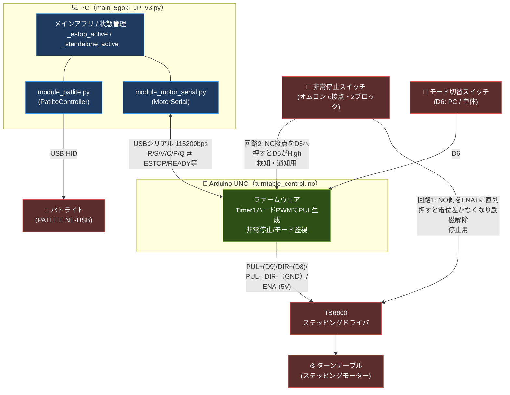
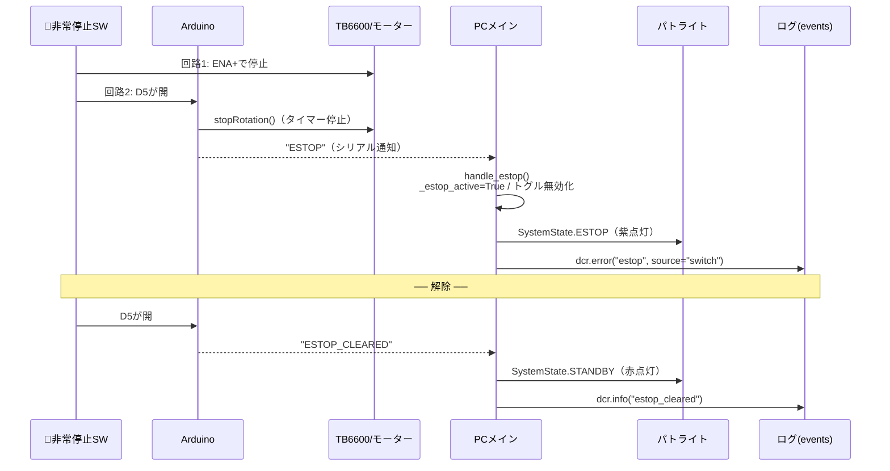
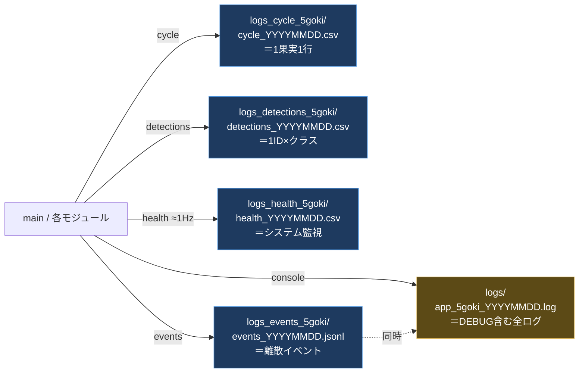

# DCRsystem — 果実自動選別システム（5号機 v3）
## 画面端にない時はすべて推論が走るバージョン

YOLO（物体検出AI）と産業用カメラを組み合わせた、果実のリアルタイム欠陥検出・自動選別システムです。
4台のBaslerカメラで果実を多角的に撮影し、AIが判定した結果に基づいてリレーボードで選別アクチュエーターを制御します。
ターンテーブルの搬送は **Arduino UNO**（USBシリアル接続）が担当し、非常停止スイッチによる安全停止に対応しています。

---

## システム概要

```
果実投入
   ↓
ターンテーブル（Arduino UNO のハードウェアタイマーでステッピングモーター制御）で搬送
   ↓
4台のカメラで撮影（上・下・内・外）
   ↓
HSVフィルタ → YOLO による欠陥検出
   ↓
リレーボードで振り分け
 ├─ 健全果 → 運搬ライン（TRANSPORT）
 └─ 被害果 → 除去ライン（REMOVE）
```

---

## 全体ファイル構成

```
DCRsystem5goki_raw_PC_app/
│
├─ main_5goki_JP_v3.py          ★メインアプリ（GUI・全デバイス統括・状態管理）
│
├─ ◆ デバイス制御モジュール
│   ├─ module_motor_serial.py     Arduino と USB シリアル通信（ターンテーブル回転）
│   ├─ module_patlite.py          パトライト制御（HID/USB・システム状態表示）
│   ├─ module_relay.py            リレーボード制御（Ydci.dll・健全果/被害果の振り分け）
│   ├─ module_cameras_5goki_v2.py Basler カメラ4台制御（pypylon）
│   └─ module_gui_JP_v3.py        GUI ウィジェット定義（PySide6）
│
├─ ◆ AI 推論
│   ├─ module_yolo_csv4_v3.py     YOLO 推論・判定状態機械・検出CSV出力
│   └─ Trained_Models/            学習済みモデル（v1〜v4, gamo_8n.pt）
│
├─ ◆ ロギング基盤
│   ├─ dcr_logger.py              構造化データログ（cycle/health/events/detections）
│   ├─ log_config.py              コンソール logging 統一設定（色付き・ファイル出力）
│   ├─ telemetry_sources.py       CPU/GPU/メモリ等のテレメトリ取得（psutil/nvml）
│   └─ analysis/queries.sql       DuckDB 解析クエリ集
│
├─ ◆ Arduino（PC外・マイコン側）
│   └─ Arduino/turntable_control.ino   ステッピングモーター制御 + 非常停止監視
│
├─ ◆ 設定ファイル
│   ├─ cam_pfs/                   Baslerカメラ設定（.pfs / カメラ4台分）
│   ├─ json/                      JSON設定（HSVフィルタ：カメラ別+共通 / リレー角度補正）
│   └─ Icon/                      GUIアイコン画像
│
├─ ◆ 出力（自動生成）
│   ├─ logs/                      コンソールのフルログ（app_5goki_YYYYMMDD.log）
│   ├─ logs_cycle_5goki/          サイクルログ CSV（1果実=1行）
│   ├─ logs_health_5goki/         ヘルスログ CSV（≈1Hz システム監視）
│   ├─ logs_detections_5goki/     検出ログ CSV（1ID×クラス）
│   ├─ logs_events_5goki/         イベントログ JSONL（離散イベント・エラー）
│   └─ evaluated_images/          判定済み画像（日付/セッション別）
│
├─ ◆ 補助スクリプト
│   ├─ standalone/                HSVキャリブレーション・遅延調整ツール
│   └─ unused/                    旧版・バックアップ（Raspberry Pi版 main 等）
│
└─ README.md / pyproject.toml
```

> モデルは `module_yolo_csv4_v3.py` の `MODEL_PATH` で指定（既定 `Trained_Models/v4_11s.pt`）。

---

## 検出カテゴリ
### 全15クラス

|  ラベル名    | 日本語名     | 振り分け先       |
|------------  |---------    |----------       |
|  birddamage  | 鳥害         | REMOVE（除去）  |
|  bracktwin   | 黒双子       | REMOVE（除去）  |
|  brownrot    | 灰星病       | REMOVE（除去）  |
|  crack       | 裂果         | REMOVE（除去）  |
|  healthy     | 健全果       | TRANSPORT（運搬 |
|  insect      | 虫害         | REMOVE（除去）  |
|  kasure(仮)  | かすれ       | REMOVE（除去）  |
|  malformation| 奇形果       | REMOVE（除去） |
|  mold        | カビ         | REMOVE（除去） |
|  stemcrack   | 果梗裂果     | REMOVE（除去） |
|  suturecrack | 縫合線裂果   | REMOVE（除去） |
|  slug        | ナメクジ     | REMOVE（除去） |
|  twins       | 双子果       | REMOVE（除去） |
|  unripe      | 未熟果       | REMOVE（除去） |
|  wilt        | 萎凋         | REMOVE（除去） |

> 振り分けは「健全果（healthy）→ TRANSPORT、それ以外 → REMOVE」の2系統。

---

## ハードウェア構成

| 機器 | モデル / 接続方法 | 用途 |
|-----|----------------|-----|
| 産業用カメラ × 4 | Basler（pypylon / USB3） | 果実の多角撮影 |
| パトライト | PATLITE NE-USB（HIDAPI / USB） | システム状態の表示 |
| リレーボード | RLY-P4/2/0B-UBT（Ydci.dll） | 振り分けアクチュエーター制御 |
| 回転台制御 | Arduino UNO（USBシリアル / 115200bps） | ステッピングモーターのパルス生成・非常停止監視 |
| ステッピングドライバ | TB6600 | Arduino のパルスでモーター駆動 |
| 非常停止スイッチ | オムロン製 （c接点＋a接点） | 安全停止（物理遮断＋PC通知） |
| PC（本アプリ） | Windows 11 + GPU推奨 | AI推論・GUI・制御統括 |

### カメラ配置

カメラ名とシリアル番号の対応は `module_cameras_5goki_v2.py` で定義（設定は `cam_pfs/<name>_<serial>.pfs` を読み込む）。

| カメラ名      | シリアル番号 | 役割 |
|-------------|----------|-----|
| cam_top     | 25453227 | 上面撮影 |
| cam_under   | 25453229 | 下面撮影（回転台遅延同期） |
| cam_inside  | 25308967 | 内側撮影（回転台遅延同期） |
| cam_outside | 25308968 | 外側撮影 |

---

## 処理パイプライン

```
果実投入 → ターンテーブル搬送(Arduino) → 4カメラ撮影(上/下/内/外)
        → HSVフィルタ → YOLO欠陥検出 → 判定確定(空フレーム8枚連続)
        → リレー振り分け ┬→ 健全果: TRANSPORT（運搬ライン）
                          └→ 被害果: REMOVE（除去ライン）
```

### 物理・通信の接続図



---

## ターンテーブル制御と非常停止（Arduino）

ターンテーブルは Arduino UNO の Timer1 ハードウェアタイマーでパルス（PUL）を生成する。
CPU負荷に影響されず正確な周波数を出し続けるため、ジッタが少なく異音が出にくい。

### 動作モード（Arduino の D6 スイッチで切替）

| モード | 動き | 非常停止時 |
|-------|-----|----------|
| **PCモード** | PCのGUIから USBシリアル経由でコマンド（回転/停止/速度）を受信して動作 | Arduinoが即停止＋PCへ `ESTOP` 通知 |
| **単体モード** | PCなしで Arduino 単独で回転（操作は非常停止スイッチのみ） | 同上。解除で自動再開 |

PC ⇄ Arduino のシリアルプロトコル（`module_motor_serial.py` / `turntable_control.ino`）:

- PC → Arduino: `R`（回転）/ `S`（停止）/ `V<1-10>`（速度）/ `C`（初期化）/ `P`（ping）/ `Q`（状態問い合わせ）
- Arduino → PC（非同期通知）: `READY`（起動完了）/ `ESTOP`・`ESTOP_CLEARED`（非常停止 作動/解除）/ `STANDALONE`・`PC_MODE`（モード切替）

### 非常停止スイッチ（2回路で二重化）

| 経路 | 配線 | 役割 | 信頼性 |
|-----|-----|-----|------|
| **回路1（回転停止）** | NO接点を TB6600 の ENA+ に直列 | 押すと **ENAの電位差がなくなり停止**＝確実にモーター停止 | ソフト不要・フェイルセーフ |
| **回路2（通知・表示）** | 空きブロックの NC 接点を Arduino D5 へ | Arduino が開を検知し、PCへ `ESTOP` 通知・状態LED点滅 | ソフト経由 |

### 非常停止 → 各デバイスの連鎖（PCモード）



---

## パトライト状態

`module_patlite.py` の `SystemState` がシステム状態とLED/ブザーを対応づける。

| 状態           | LED       | ブザー | タイミング |
|--------------|----------|-------|---------|
| INITIALIZING | 黄 点灯    | なし  | 起動・デバイス接続中 |
| STANDBY      | 赤 点灯    | なし  | 待機中（停止状態） |
| RUNNING      | 緑 点灯    | なし  | 正常運転中 |
| ESTOP        | 紫 点灯    | なし  | 非常停止中（人が監視中のためブザー無） |
| ERROR        | 赤 点滅    | なし  | 想定外異常（カメラ接続エラー等） |
| STANDALONE   | 消灯      | なし  | Arduino単体モード中（PC管理外） |

> PC側は `_estop_active` / `_standalone_active` の2フラグで排他制御し、解除時の表示の取りこぼしを防ぐ（`_apply_lock_state`）。

---

## 動作フロー

1. **起動** → スタートアップウィンドウが表示される
2. **接続** → パトライト・リレーボード・カメラ・Arduino を初期化（パトライトが黄点灯）
3. **状態同期** → Arduino に `Q` を送り、現在の非常停止／モード状態をPC側へ反映
4. **待機** → 全デバイス接続完了でメインウィンドウに移行（パトライトが赤点灯）
5. **運転開始** → トグルスイッチをONにするとモーターが回転し推論が始まる（パトライトが緑点灯）
6. **推論** → 4カメラの映像を並行してYOLOで判定し、確定した結果をリレーに送信
7. **停止** → トグルスイッチをOFFにするか電源ボタンで終了。非常停止スイッチでも即停止

---

## 推論ロジック

`module_yolo_csv4_v3.py` の定数で制御。

- **信頼度閾値**: 0.75（`CONFIDENCE_THRESHOLD`）。双子果・未熟果（`twins` / `unripe`）は 0.93（`LOW_CONF_LABELS_THRESHOLD`）
- **確定タイミング**: 空フレームが 8 枚連続した時点で直前の果実の判定を確定（`EMPTY_FRAME_THRESHOLD`）
- **最終判定の優先順位**:
  1. **健全果または一般的な不良品**（mold / stemcrack / birddamage / malformation / crack / wilt、および双子果で信頼度 0.93 以上）が存在する場合を最優先で検討
     - 健全果と不良品が共存する場合：健全果の信頼度 ≥ 0.9（`HEALTHY_PRIORITY_CONF`）かつ不良品の信頼度 < 0.9 のときのみ健全果を優先、それ以外は不良品優先
  2. 上記が一切なく、**未熟果（信頼度 0.93 以上）のみ**検出された場合 → 未熟果として確定
  3. フォールバック: 信頼度が最も高い検出結果を採用

---

## ログ構成

ログは **2系統** で設計されている。両者は **events** で接続され、エラー等の離散イベントはコンソール（System B の整形表示）と `events_*.jsonl`（System A の構造化記録）の**両方**へ同時に出る。

- **System A: 構造化データログ**（`dcr_logger.py`）… 機械可読。DuckDB で三層解析を行うための `cycle` / `health` / `events` / `detections` の4層。ホットパスをブロックしない（別スレッド書き込み）。標準ライブラリのみで動作。
- **System B: コンソール出力の統一**（`log_config.py`）… 散在していた `print` を Python の `logging` に集約し、書式・レベル・モジュール名・色を統一する。

出力先（`line` 既定は `5goki`）。データログは種類ごとに `logs_<kind>_5goki/` フォルダへ分かれる。`timestamp` は `YYYY-MM-DD HH:MM:SS.mmm` のローカル時刻（ミリ秒精度）。

### 出力ファイル一覧



| 出力先 | 形式 | 粒度 | 役割 |
|-------|-----|-----|-----|
| `logs_cycle_5goki/cycle_YYYYMMDD.csv` | CSV | 1果実=1行 | 撮影〜推論〜排出のタイミング/レイテンシと判定結果 |
| `logs_detections_5goki/detections_YYYYMMDD.csv` | CSV | 1ID×クラス | 各果実でどのクラスをどの信頼度で何個検出したか |
| `logs_health_5goki/health_YYYYMMDD.csv` | CSV | ≈1Hz | CPU/GPU/メモリ/VRAM等のシステム健全性監視 |
| `logs_events_5goki/events_YYYYMMDD.jsonl` | JSONL | 離散イベント | 起動/停止・非常停止・Arduino接続・エラー等 |
| `logs/app_5goki_YYYYMMDD.log` | テキスト | 全ログ | コンソールと同じ内容＋DEBUG |

### 各ログで「わかること」

**① cycle（1果実ごと）— ボトルネック・遅延の分析**
- `capture_latency[ms]` / `infer_latency[ms]` / `preproc` / `postproc` … 各工程の所要時間
- `frame_dropped[n]` … フレーム取りこぼし
- `hsv_flag` / `hsv_mask_ratio` … HSVフィルタの通過状況
- `eject_flag` / `planned_eject_ts` / `eject_delay[ms]` / `outcome_flag` … 排出の予定vs実績・成否
- HW負荷も併記（`gpu_temp` `gpu_util` `gpu_power` 等）→ **果実が来た瞬間の負荷**を相関分析

**② detections（多ラベル）— AI判定の中身**
- `class` / `conf_min` / `conf_max` / `conf_ave` / `num_detections` / `final_flag`
- →「健全と判定したが裏に低信頼の不良があった」等、**判定の根拠**を後追いできる

**③ health（≈1Hz）— 連続的なシステム健全性 & 障害予兆**
- CPU/GPU 温度・使用率・クロック、VRAM使用量、消費電力 → **サーマルスロットリング/HWダウングレード判断**
- `proc_rss[mb]` / `torch_vram_alloc[mb]` / `cycles_total[n]` → **メモリ/VRAMリーク検出**（MB/サイクル算出）
- `queue_depth[n]` … フレームキューの詰まり
- `dropped_logs[n]` … ロガー自身が捨てたログ数（自己監視）

**④ events（JSONL）— 出来事の時系列**
- `startup` / `shutdown`（稼働時間）、`gui_state`（run/stop）
- `estop` / `estop_cleared`（非常停止の作動・解除と原因）
- `arduino_connect` / `arduino_disconnect` / `arduino_heartbeat`（接続・遅延・断線）
- `camera_error`、`mem_snapshot`（tracemalloc）など

### 設計上の約束（なぜこの形か）

| 約束 | 内容 |
|---|---|
| ホットパス非ブロッキング | `dcr.cycle()` は `queue.put_nowait` のみ。書込み・fsyncは専用スレッド。満杯時はドロップして `dropped_logs` 加算（ループは止めない） |
| 計測は単調時計 | レイテンシ（`*_latency_ms` 等）は `time.perf_counter()` 差分。壁時計 `timestamp` は結合アンカー専用（文字列比較でも時系列順） |
| 時間軸の二重化 | 同じHW指標を **cycle（果実が来た瞬間・不等間隔）** と **health（1Hz・アイドル含む）** の両方に記録し、負荷時とアイドル時を比較可能に |
| テレメトリはキャッシュ | GPU/カメラ温度は health スレッドが ≈1Hz で `Telemetry` に格納し、cycle は最新値を読むだけ（ホットパスで nvml を叩かない） |
| 結合アンカー | `timestamp`（ms精度）と `cycle_id` で4ファイルを DuckDB で突き合わせ |
| クラッシュ耐性 | CSV追記＋`flush_interval_s`（既定1秒）ごとに flush+fsync。ヘッダーは新規時のみ。日付でローテーション |
| 単位は列名に埋める | `_ms` `_c` `_mhz` `_mb` `_gb` 等。欠損は空文字 |
| 標準ライブラリのみ | コア `dcr_logger.py` は外部依存なし。psutil/nvml/torch が無くても該当列が空になるだけで落ちない |
| schema_version | 全行・events に自動付与（現行 `1.1.0`）。旧フォーマットと混在しても判別可能 |

### 公開 API

```python
from dcr_logger import DCRLogger, Telemetry
import log_config

# --- 起動時（main の最初）---
log_config.setup_logging(line="5goki")            # コンソール整形（System B）を先に
dcr = DCRLogger(base_dir="logs", line="5goki")    # データログ（System A）
dcr.start(log_startup=False)                      # 書き込みスレッドだけ先に起動
# … モデルロード後、構成が揃ってから startup を記録（precision 等を載せるため）
dcr.log_startup(model="v4_11s.pt", imgsz=640, precision="fp32", batch=1)
dcr.start_mem_snapshot(60.0)                      # tracemalloc 定期スナップショット（任意）

# --- コンソール出力（各モジュール）---
mlog = log_config.get_logger("motor")
mlog.info("接続しました (COM3)")     # INFO: コンソール + ファイル
mlog.warning("READY応答がありません") # WARN: 黄
mlog.error("接続エラー: ...")        # ERROR: 赤
mlog.debug("[Serial Send] ROTATE")  # DEBUG: ファイルのみ

# --- 構造化イベント（コンソール + JSONL 両方）---
dcr.info("warmup_done", warmup_frames=30, elapsed_ms=812)
dcr.warn("gpu_throttle", clock_mhz=1200, expected_mhz=1980, gpu_temp_c=86)
dcr.error("serial_timeout", port="COM3", rtt_ms=520, retry=3, cycle_id=cid)

# --- サイクル（1果実ごと・非ブロッキング。渡せる値だけでよい）---
dcr.cycle(cycle_id=cid, infer_latency_ms=inf_ms,
          hsv_pass=1, hsv_mask_ratio=0.62, eject_decision=1, outcome=1)

# --- ヘルス（≈1Hz・環境系の正本 + リソース/リーク系）---
dcr.health(cpu_temp_c=55.0, gpu_temp_c=70.0, gpu_clock_mhz=1800, gpu_util=80,
           queue_depth=3, proc_rss_mb=1234.5, gpu_mem_used_mb=4096, gpu_power_w=120.5,
           torch_vram_alloc_mb=500, torch_vram_reserved_mb=800, cycles_total=cid)

# --- 多ラベル検出（1ID×クラス集約）---
dcr.detections(cycle_id=cid, items=[
    {"class": "crack", "confidence": 0.88, "conf_min": 0.70, "conf_max": 0.92, "n": 3, "is_final": 1},
    {"class": "suturecrack", "confidence": 0.41, "conf_min": 0.41, "conf_max": 0.41, "n": 1, "is_final": 0},
])

# --- 終了時 ---
dcr.stop()                                        # 残りを flush + shutdown イベント
```

不明な列は空欄で埋まる（`extrasaction="ignore"`）。呼び出し側は分かる値だけ渡せばよい。

### 三層解析（修論用の狙い）

```
検出層(detections) ── 何を、どの確信度で見分けたか（AIの精度）
        │ cycle_id で結合
タイミング層(cycle) ── 各工程に何ms、排出予定とどれだけズレたか（速度・同期）
        │ timestamp で結合
機械層(cycle.outcome / health) ── 実際に正しく弾けたか / HWは無理してないか（信頼性）
```

> 詳細クエリは `analysis/queries.sql`（DuckDB）。解析設計はユーザーが後日実施予定。

### スキーマ変更履歴（schema_version = "1.1.0"）

- **schema_version を全 CSV 行・events に自動付与**（`_write_csv` / `_write_det` / `event()` が注入。呼び出し側は渡さなくてよい）。
- **環境系を health に連続系列として記録**: `cpu_temp_c, gpu_temp_c, gpu_clock_mhz, cpu_util, gpu_util, cam_*_temp_c` を毎サンプル。イベント固有メトリクスは health に入れない。
- **HWダウングレード判断**: health に `gpu_mem_used_mb` / `gpu_power_w` を追加。`startup` イベントに `model / imgsz / precision / batch / gpu_name / gpu_mem_total_mb` を載せる（`precision` はモデルの実 dtype から動的取得）。
- **リーク検出**: health に `proc_rss_mb` / `torch_vram_alloc_mb` / `torch_vram_reserved_mb` / `cycles_total` を追加。`mem_snapshot` イベントを約60秒ごとに tracemalloc から記録（`start_mem_snapshot()`）。
- **HW負荷系を cycle 軸にも複製**（時間軸の二重化）: `gpu_temp_c / gpu_util / gpu_clock_mhz / gpu_mem_used_mb / gpu_power_w / cpu_util` を cycle にも持たせる。cycle 側は `Telemetry` キャッシュ（health が1Hzで更新した最新値）を読むだけ（最大約1秒前の値）。detections は cycle と同軸なので複製しない。
- **カメラ温度は4方向のまま**（`cam_top/under/in/out_temp_c`）。
- **psu_voltage_v は省略**（実機に PSU 電圧センサーが無いため）。未配線で常に空欄だった `exposure_us` / `gain` / `encoder_pos`（cycle）も削除済み。
- nvml / torch / psutil 不在時は該当列が空欄になるだけでアプリは落ちない。

---

## セットアップ

### 前提条件

- Windows 11
- Python 3.12
- NVIDIA GPU（CUDA 12.4 推奨）
- Basler カメラドライバ（pylon SDK）
- `Ydci.dll`（リレーボードのドライバ）がシステムパスまたは実行ディレクトリに配置されていること
- Arduino UNO に `Arduino/turntable_control.ino` を書き込み済みであること

### 依存パッケージのインストール

```bash
uv sync
```

主な依存パッケージ: `ultralytics`, `pypylon`, `PySide6`, `opencv-python`, `hidapi`, `pyserial`
（任意: `psutil`, `nvidia-ml-py` … health ログのテレメトリ取得用。無くてもアプリは動作する）

### 実行

```bash
python main_5goki_JP_v3.py
```

---

## 搬送スピード設定

GUIの設定画面からスピードを 1〜10 で調整できる。
スピードに応じて Arduino のパルス間隔（`SPEED_DELAY_US`）とカメラの表示遅延が同期される。

| スピード値 | パルス HIGH/LOW 幅 |
|---------|------------------|
| 1（最遅） | 1.0 ms |
| 5        | 0.6 ms |
| 10（最速）| 0.1 ms |

> 値はレベルごとに 1.0ms → 0.1ms まで 0.1ms 刻み（`module_motor_serial.py` / スケッチの `SPEED_DELAY_US` と一致）。
